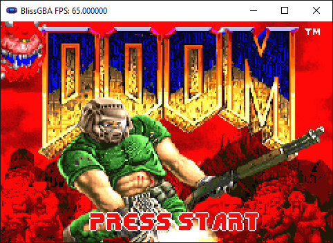

# BlissGBA
### 🌟Goal: Aiming for a balance of usability/accuracy and to be able to play most commercial games🌟

## Cpu
✅Hardware Interrupts\
✅Software Interrupts\
✅Passes Armwrestler CPU test\
✅Passes FuzzArm CPU test\
✅Passes Jsmolka's CPU test suite\
⬛Timers

## DMA 
⬛DMA Channel 0\
⬛DMA Channel 1\
⬛DMA Channel 2\
✅DMA Channel 3

## Ppu
✅Basic Mode Switching\
✅Bitmap Mode 3\
✅Bitmap Mode 4\
⬛Bitmap Mode 5\
⬛Tiled Mode 0\
⬛Tiled Mode 1\
⬛Tiled Mode 2

## Showcase

